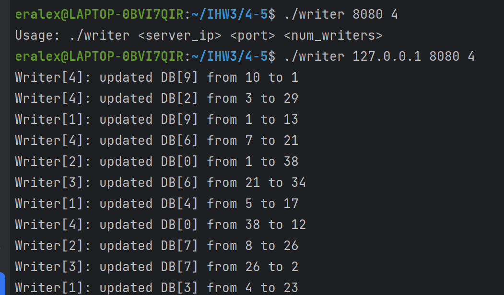
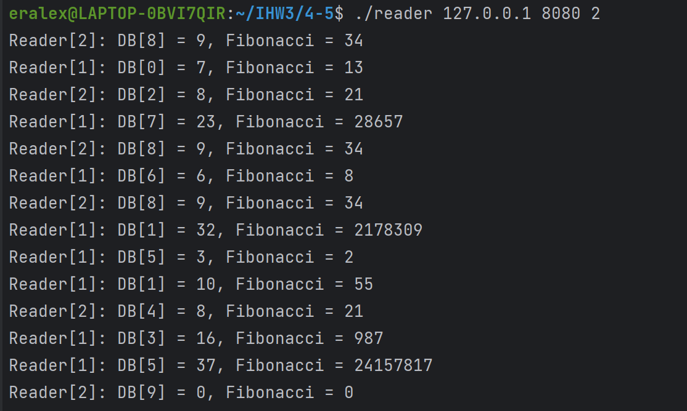
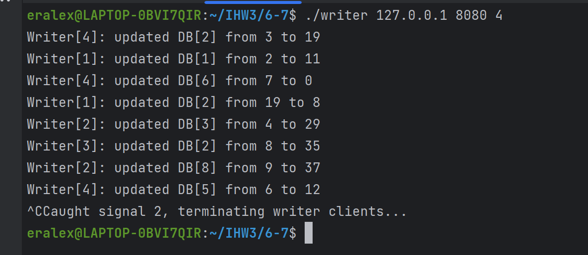
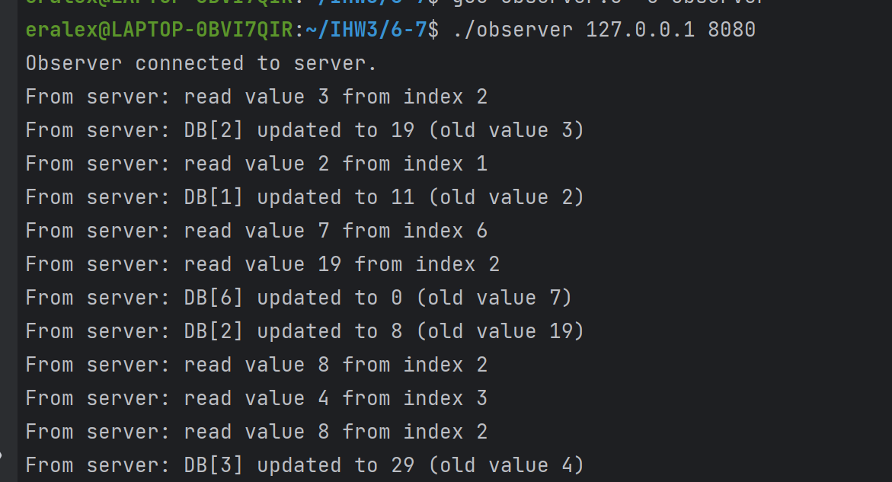
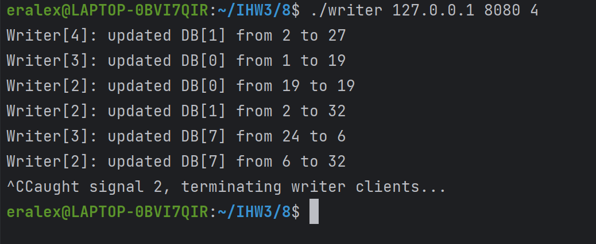
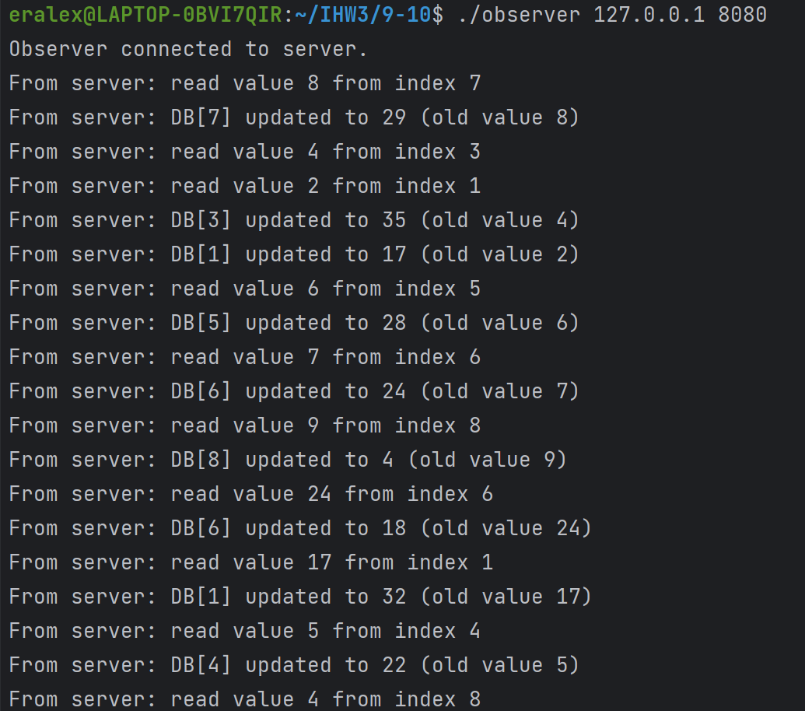
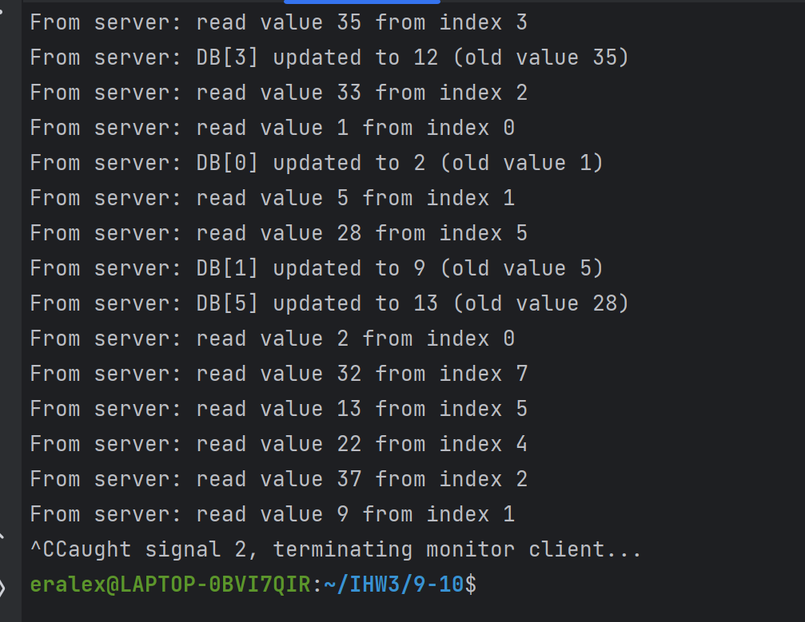
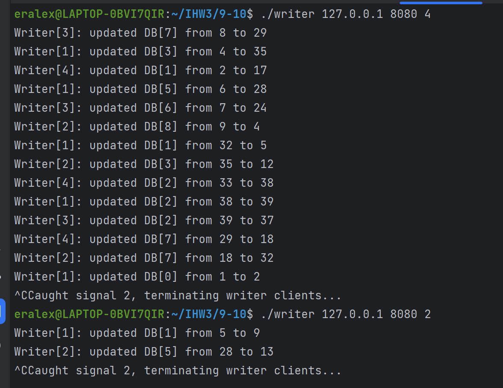

# Отчет

ФИО: Ермолаева Елена Александровна

Группа: БПИ224

Вариант: 5

## Условие

__Задача о читателях и писателях.__ Базу данных, представленную массивом целых положительных чисел, разделяют два типа
процессов: N читателей и K писателей. Читатели периодически
просматривают случайные записи базы данных и выводя номер
свой номер (например, PID), индекс записи, ее значение, а также
вычисленное значение числа Фибоначчи. Писатели изменяют случайные записи на случайное число и также выводят информацию о
своем номере, индексе записи, старом значении и новом значении.
Предполагается, что в начале БД находится в непротиворечивом
состоянии (все числа отсортированы, например, по возрастанию).
Каждая отдельная новая запись переводит БД из одного непротиворечивого состояния в другое (то есть, новая сортировка
может
поменять индексы записей или переставить числа). Для предотвращения взаимного влияния транзакций процесс–писатель должен
иметь исключительный доступ к БД. Если к БД не обращается
ни один из процессов–писателей, то выполнять транзакции могут
одновременно сколько угодно читателей.

## 4 - 5 баллов

__Работа сервера__

Читатели и писатели создают UDP-сокеты и отправляют запросы на сервер, который прослушивает входящие сообщения.

Взаимодействие между клиентами и сервером:

Читатели:

Читатели генерируют случайный индекс и отправляют запрос на чтение (READ <index>) на сервер с помощью функции sendto().
Сервер получает запрос, извлекает значение по указанному индексу из массива и отправляет его читателю в формате
VALUE <value> с помощью функции sendto().
Читатель, получив значение с использованием функции recvfrom(), вычисляет значение числа Фибоначчи для полученного числа
и выводит результат в соответствии с заданием.
Писатели:

Писатели отправляют запрос на чтение текущего значения по сгенерированному индексу, отправляя сообщение в формате
READ <index> на сервер с помощью функции sendto().
Сервер получает запрос и отправляет текущее значение по указанному индексу в формате VALUE <value> с помощью функции
sendto().
Получив значение с помощью функции recvfrom(), писатели генерируют новое значение и отправляют на сервер запрос на
запись нового значения в формате WRITE <index> <new_value> с помощью функции sendto().
Сервер получает запрос на запись, обновляет значение по указанному индексу в базе данных и отправляет подтверждение об
обновлении с помощью функции sendto().

### Тесты

## 6 - 7 баллов

Принцип взаимодействия читателей и писателей с сервером аналогичен на оценку 4-5, за исключением подключения мониторинга
работы сервера.

Читатели, писатели и наблюдатели создают UDP-сокеты и отправляют запросы на сервер, который прослушивает входящие
сообщения.

Cервер получает запросы на запись, чтение, обновляет значение по указанному индексу в базе данных и отправляет
подтверждение об обновлении с помощью функции sendto().

Наблюдатели (Observer):
Наблюдатель подключается к серверу через UDP-сокет и отправляет сообщение OBSERVER для идентификации с использованием
функции sendto().
Сервер получает запрос и регистрирует адрес клиента для отправки уведомлений.
Когда сервер обрабатывает запросы от читателей и писателей, он формирует соответствующие сообщения для наблюдателя и
отправляет их с использованием функции sendto().

__Тест__

## 8

Подключение нескольких наблюдателей через UDP реализовано путем регистрации адресов клиентов-обсерверов на сервере. При
получении сообщения "OBSERVER" сервер сохраняет адрес клиента. Затем сервер отправляет обновления состояния всем
зарегистрированным наблюдателям через sendto(), используя сохраненные адреса клиентов.

__Тест__

(с несколькими наблюдателями)

# 9

Сервер динамически обрабатывает новые подключения клиентов и наблюдателей (`struct sockaddr_in observer_clients[MAX_CLIENTS]`), добавляя их адреса в соответствующие массивы.
Это позволяет новым клиентам подключаться к работающему серверу без необходимости перезапуска.

Все записи наблюдателя:

Подключение писателей 2 раза

Подключение читателей после отключения писателей

